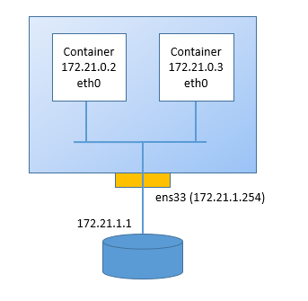

## Docker networking
Docker networking features provide complete isolation for containers. Follows an overview of the default networking behavior that Docker Engine delivers natively. It describes the type of networks created by default and how to create user-defined networks. The Docker networking model is based on the [libnetwork](https://github.com/docker/libnetwork/blob/master/docs/design.md) implementation.

  * [Default Networks](#default-networks)
  * [User defined bridge networks](#user-defined-bridge-networks)
  * [Using custom Docker networks](#using-custom-docker-networks)
  * [Inter Containers Communication](#inter-containers-communication)
  * [Embedded DNS Service](#embedded-dns-service)
  * [MAC VLAN mode](#mac-vlan-mode)

### Default networks
Installing Docker Engine, there are three default networks on the host machine
```
# docker network ls
NETWORK ID          NAME                DRIVER
34a43cf4f024        bridge              bridge
83af822c1610        host                host
02c1fcf12795        none                null
```

The bridge network represents the ``docker0`` network present in all Docker installations as part of a host network stack
```
# ifconfig
docker0: flags=4163<UP,BROADCAST,RUNNING,MULTICAST>  mtu 1500
        inet 172.17.0.1  netmask 255.255.0.0  broadcast 0.0.0.0
        inet6 fe80::42:67ff:fe78:6b35  prefixlen 64  scopeid 0x20<link>
        ether 02:42:67:78:6b:35  txqueuelen 0  (Ethernet)

ens32: flags=4163<UP,BROADCAST,RUNNING,MULTICAST>  mtu 1500
        inet 10.10.10.26  netmask 255.255.255.0  broadcast 10.10.10.255
        inet6 fe80::20c:29ff:fe1d:93bc  prefixlen 64  scopeid 0x20<link>
        ether 00:0c:29:1d:93:bc  txqueuelen 1000  (Ethernet)
...
```

The ``docker0`` interface belongs to a Linux bridge network created by docker at daemon start time. Docker randomly chooses an address and subnet from the private range defined by RFC 1918 that are not in use on the host machine, and assigns it to the ``docker0``.

    bridge name     bridge id               STP enabled     interfaces
    docker0         8000.024267786b35       no

All the docker containers will be connected to the ``docker0`` bridge by default via a virtual Ethernet interface. The containers connnected to the ``docker0`` bridge could use the iptables NAT rules created by docker to communicate with the outside world. The IP addresses space of the bridge network is 172.17.0.0/16 by default.

Docker networking leverages on Linux namespace kernel feature. Since Linux expects namespase listed under ``/var/run/netns`` directory, in order to use standard Linux net namespace tools such ``ip netns``, you should link docker namespace dir ``/var/run/docker/netns`` directory.
```
# /var/run/
# ln -s /var/run/docker/netns .
# ls -l
...
lrwxrwxrwx  1 root     root       21 Mar 23 12:55 netns -> /var/run/docker/netns
```

Create a container and check the host is creating a new virtual Ethernet interface:
```
# docker run -d -p 80:80 --name webserver kalise/httpd
# ifconfig
...
veth80f977c: flags=4163<UP,BROADCAST,RUNNING,MULTICAST>  mtu 1500
        inet6 fe80::4d2:f3ff:fee5:c975  prefixlen 64  scopeid 0x20<link>
        ether 06:d2:f3:e5:c9:75  txqueuelen 0  (Ethernet)
...
# brctl show
bridge name     bridge id               STP enabled     interfaces
docker0         8000.024267786b35       no              veth80f977c
```

Connect to the container just created to inspect its own network stack

```
# docker exec -it webserver /bin/bash
[root@7867782e7966 /]# yum install net-tools -y
[root@7867782e7966 /]# ifconfig
eth0: flags=4163<UP,BROADCAST,RUNNING,MULTICAST>  mtu 1500
        inet 172.17.0.2  netmask 255.255.0.0  broadcast 0.0.0.0
        inet6 fe80::42:acff:fe11:2  prefixlen 64  scopeid 0x20<link>
        ether 02:42:ac:11:00:02  txqueuelen 0  (Ethernet)

lo: flags=73<UP,LOOPBACK,RUNNING>  mtu 65536
        inet 127.0.0.1  netmask 255.0.0.0
        inet6 ::1  prefixlen 128  scopeid 0x10<host>

[root@7867782e7966 /]# exit
```

The ``docker run`` command automatically adds new containers to the bridge network. Containers in this default network are able to communicate with each other using ``docker0`` bridge IP addresses. For legacy reasons, Docker does not support automatic service discovery on the default bridge network.

Figure below shows how containers connect to the host via ``docker0`` bridge


A virtual ethernet device or ``veth`` is a Linux networking interface that acts as a connecting wire between two network
namespaces. A veth is a full duplex link that has a single interface in each namespace. Traffic in one interface is directed
out the other interface. Docker network drivers utilize veths to provide explicit connections between namespaces when
Docker networks are created. When a container is attached to a Docker network, one end of the veth is placed inside the
container, usually seen as the ``eth0`` interface, while the other is attached to the Docker network.

The ``iptables`` is the native packet filtering system that has been a part of the Linux kernel. It's a L3/L4 firewall that provides rule chains for packet marking, masquerading, and dropping. The built-in Docker network drivers utilize iptables extensively to segment network traffic, provide host port mapping, and to mark traffic for load balancing decisions.

Inspect the bridge network
```
# docker network inspect bridge
```
```json
[
    {
        "Name": "bridge",
        "Id": "edfb283dfae43d2d820c8a54e0ca4c80eee079f52093763dd1cbc8c2cfbf050d",
        "Scope": "local",
        "Driver": "bridge",
        "IPAM": {
            "Driver": "default",
            "Options": null,
            "Config": [
                {
                    "Subnet": "172.17.0.0/16",
                    "Gateway": "172.17.0.1"
                }
            ]
        },
        "Containers": {
            "af999a749414b55ca2d5280e22ae677a51d0fe27004aeb16a6b7d39b8dde7a1e": {
                "Name": "webserver",
                "EndpointID": "0df526d9aade3476a3bf53c4b1205d960621e6bef8dd334f2a5cb6b563122da3",
                "MacAddress": "02:42:ac:11:00:02",
                "IPv4Address": "172.17.0.2/16",
                "IPv6Address": ""
            }
        },
        "Options": {
            "com.docker.network.bridge.default_bridge": "true",
            "com.docker.network.bridge.enable_icc": "true",
            "com.docker.network.bridge.enable_ip_masquerade": "true",
            "com.docker.network.bridge.host_binding_ipv4": "0.0.0.0",
            "com.docker.network.bridge.name": "docker0",
            "com.docker.network.driver.mtu": "1500"
        }
    }
]
```

Bridge network is the most common option for Docker container. Some other options are:
1. host mode
2. container mode
3. none mode

In the host mode, the container shares the networking namespace of the host, directly exposing it to the outside world. This means you need to use port mapping to reach services inside the container.
```
# docker run -d -p 80 --net=host --name webserver httpd
# docker exec -it webserver /bin/bash
/usr/local/apache2# ip addr
1: lo: <LOOPBACK,UP,LOWER_UP> mtu 65536 qdisc noqueue state UNKNOWN group default
    link/loopback 00:00:00:00:00:00 brd 00:00:00:00:00:00
    inet 127.0.0.1/8 scope host lo
       valid_lft forever preferred_lft forever
    inet6 ::1/128 scope host
       valid_lft forever preferred_lft forever
2: ens32: <BROADCAST,MULTICAST,UP,LOWER_UP> mtu 1500 qdisc pfifo_fast state UP group default qlen 1000
    link/ether 00:0c:29:1d:93:bc brd ff:ff:ff:ff:ff:ff
    inet 10.10.10.26/24 brd 10.10.10.255 scope global ens32
       valid_lft forever preferred_lft forever
    inet6 fe80::20c:29ff:fe1d:93bc/64 scope link
       valid_lft forever preferred_lft forever
3: docker0: <NO-CARRIER,BROADCAST,MULTICAST,UP> mtu 1500 qdisc noqueue state DOWN group default
    link/ether 02:42:67:78:6b:35 brd ff:ff:ff:ff:ff:ff
    inet 172.17.0.1/16 scope global docker0
       valid_lft forever preferred_lft forever
    inet6 fe80::42:67ff:fe78:6b35/64 scope link
       valid_lft forever preferred_lft forever
/usr/local/apache2# exit
#
```

Inspect the host network
```
# docker network inspect host
```

```json
[
    {
        "Name": "host",
        "Id": "3dfa03da9332cb7e8ad1776fbc4f2c27536a3450d2e186e85ed2941177ddda90",
        "Scope": "local",
        "Driver": "host",
        "IPAM": {
            "Driver": "default",
            "Options": null,
            "Config": []
        },
        "Containers": {
            "bad4aa0bc42a685928b44e2cb97b8a6598f72c046af35e08e883c00e49c22f22": {
                "Name": "webserver",
                "EndpointID": "2fff57f78811a3b9a4ac7b299362ed579e73e0101d4438584a7cdfec57cfe9fb",
                "MacAddress": "",
                "IPv4Address": "",
                "IPv6Address": ""
            }
        },
        "Options": {}
    }
]
```

In the container mode, a container is forced to reuse the networking namespace of another container. This is used if you want to provide custom networking from said container, this is for example, what Kubernetes uses to provide networking for multiple containers at same time using a single IP address.
```
# docker run -d -p 80:80 --name=web httpd
# docker run -it --net=container:web --name=shell busybox
/ # ifconfig
eth0      Link encap:Ethernet  HWaddr 02:42:AC:11:00:02
          inet addr:172.17.0.2  Bcast:0.0.0.0  Mask:255.255.0.0
          inet6 addr: fe80::42:acff:fe11:2/64 Scope:Link

lo        Link encap:Local Loopback
          inet addr:127.0.0.1  Mask:255.0.0.0
          inet6 addr: ::1/128 Scope:Host

/ # exit
```

The none mode does not configure networking. This is useful for containers that don’t require network access.
```
# docker run --net=none -itd --name=centos-none centos
```

### User defined bridge networks
Docker permits to create user defined networks that better isolate containers. Docker provides network drivers for creating these networks. With Docker, it is possible to create multiple networks and add containers to more than one network. Containers can only communicate within networks but not across networks. A container attached to two networks can communicate with member containers in either network. When a container is connected to multiple networks, its external connectivity is provided via the first non internal network.

Figure below shows the model of Docker multiple networking


Creating a custom bridge network
```
# docker network create --subnet=192.168.1.0/24 --gateway=192.168.1.1 bridge1
# docker network ls
NETWORK ID          NAME                DRIVER
34a43cf4f024        bridge              bridge
abb8c6759678        bridge1             bridge
83af822c1610        host                host
02c1fcf12795        none                null
```

a new interface called ``br-<net-id>`` is added to the host network stack
```
# ifconfig
br-86e7fa795e38: flags=4099<UP,BROADCAST,MULTICAST>  mtu 1500
        inet 192.168.1.1  netmask 255.255.255.0  broadcast 0.0.0.0
        ether 02:42:dc:79:45:15  txqueuelen 0  (Ethernet)

docker0: flags=4163<UP,BROADCAST,RUNNING,MULTICAST>  mtu 1500
        inet 172.17.0.1  netmask 255.255.0.0  broadcast 0.0.0.0
        ether 02:42:e1:f4:01:73  txqueuelen 0  (Ethernet)

# brctl show
bridge name     bridge id               STP enabled     interfaces
br-86e7fa795e38 8000.0242e3712735       no
docker0         8000.024267786b35       no
```


It is possible to force the name of the interface to be the same of the network label
```
# docker network create \
--subnet=192.168.2.0/24 \
--gateway=192.168.2.1 \
--opt="com.docker.network.bridge.name=bridge2" \
bridge2

# ifconfig
br-c5df690ed81e: flags=4099<UP,BROADCAST,MULTICAST>  mtu 1500
        inet 192.168.1.1  netmask 255.255.255.0  broadcast 0.0.0.0
        ether 02:42:dc:79:45:15  txqueuelen 0  (Ethernet)

bridge2: flags=4163<UP,BROADCAST,RUNNING,MULTICAST>  mtu 1500
        inet 192.168.2.1  netmask 255.255.255.0  broadcast 0.0.0.0
        inet6 fe80::42:e8ff:fe12:3268  prefixlen 64  scopeid 0x20<link>
        ether 02:42:e8:12:32:68  txqueuelen 0  (Ethernet)

docker0: flags=4163<UP,BROADCAST,RUNNING,MULTICAST>  mtu 1500
        inet 172.17.0.1  netmask 255.255.0.0  broadcast 0.0.0.0
        ether 02:42:e1:f4:01:73  txqueuelen 0  (Ethernet)
```

Inspect the networks just created
```
# docker network inspect bridge2
```

```json
[
    {
        "Name": "bridge2",
        "Id": "edb88c34314b639632ee73d499bb0a4a25a343b401d857d050fcb46cc2d8105d",
        "Scope": "local",
        "Driver": "bridge",
        "EnableIPv6": false,
        "IPAM": {
            "Driver": "default",
            "Options": {},
            "Config": [
                {
                    "Subnet": "192.168.2.0/24",
                    "Gateway": "192.168.2.1"
                }
            ]
        },
        "Internal": false,
        "Containers": {
            }
        },
        "Options": {
            "com.docker.network.bridge.name": "bridge2"
        },
        "Labels": {}
    }
]
```

Start a container on this network
```
# docker run -d -p 80:80 --net=bridge2 --name apache kalise/httpd
# docker network inspect bridge2
```

```json
[
    {
        "Name": "bridge2",
        "Id": "edb88c34314b639632ee73d499bb0a4a25a343b401d857d050fcb46cc2d8105d",
        "Scope": "local",
        "Driver": "bridge",
        "EnableIPv6": false,
        "IPAM": {
            "Driver": "default",
            "Options": {},
            "Config": [
                {
                    "Subnet": "192.168.2.0/24",
                    "Gateway": "192.168.2.1"
                }
            ]
        },
        "Internal": false,
        "Containers": {
            "5194ff09e858ea16a6e5577f9c33bb1313a06a599c348f216990d6c54dfdae26": {
                "Name": "apache",
                "EndpointID": "73e7931dc11d967c2129e7e53c5b47d1f212ec7977e8df6bf9bf81e94252fc3b",
                "MacAddress": "02:42:c0:a8:02:03",
                "IPv4Address": "192.168.2.3/24",
                "IPv6Address": ""
            }
        },
        "Options": {
            "com.docker.network.bridge.name": "bridge2"
        },
        "Labels": {}
    }
]
```

```
# docker exec -it apache bash
[root@5194ff09e858 /]# ifconfig
eth0: flags=4163<UP,BROADCAST,RUNNING,MULTICAST>  mtu 1500
        inet 192.168.2.3  netmask 255.255.255.0  broadcast 0.0.0.0
        ether 02:42:c0:a8:02:03  txqueuelen 0  (Ethernet)

[root@5194ff09e858 /]# exit
```

A running container can be attached to a network
```
[root@centos ~]# docker network connect bridge1 apache
[root@centos ~]#
[root@centos ~]# docker exec -it apache bash
[root@5194ff09e858 /]# ifconfig
eth0: flags=4163<UP,BROADCAST,RUNNING,MULTICAST>  mtu 1500
        inet 192.168.2.3  netmask 255.255.255.0  broadcast 0.0.0.0
        ether 02:42:c0:a8:02:03  txqueuelen 0  (Ethernet)

eth1: flags=4163<UP,BROADCAST,RUNNING,MULTICAST>  mtu 1500
        inet 192.168.1.3  netmask 255.255.255.0  broadcast 0.0.0.0
        ether 02:42:c0:a8:01:03  txqueuelen 0  (Ethernet)

[root@5194ff09e858 /]# exit
```

Finally, remove the network
```
# docker network rm bridge2
Error response from daemon: network bridge2 has active endpoints
# docker rm -f apache
apache
# docker network rm bridge2
```

### Using custom Docker networks
Docker networking permits to build network infrastructures for real use cases. In the following example, we are going to deploy a multi-tier application like a WorPress blog platform made of a MariaDB database and an Apache/PHP server. The Apache/PHP application is listening for incoming connections from the host on standard port 80. It uses an internal user-defined network to comunicate with the MariaDB server listening on standard port 3306. The MariaDB server is attached on the internal network and does not expose any port to the host.

Create an internal network
```
# docker network create --subnet=192.168.1.0/24 --gateway=192.168.1.1 internal
```

and start a MariaDB database server on this network
```
# docker run -d --name mariadb --net internal bitnami/mariadb:latest
```

Start a WordPress application on the internal network and expose the port 80 to the host
```
# docker run -d --name wordpress -p 80:80 bitnami/wordpress:latest
```

### Inter Containers Communication
By default, Docker has inter-container communication enabled by the option ``enable_icc=true`` meaning that containers on a host are free to communicate without restrictions. Communication to the outside world is controlled via iptables and ip_forwarding.

For security reasons, it is possible to disable the inter-container communication by setting the option to ``enable_icc=false`` in the user defined networks. Create an internal network with inter-container communication disabled
```
# docker network create \
> --subnet=192.168.2.0/24 \
> --gateway=192.168.2.1 \
> --opt="com.docker.network.bridge.enable_icc=false" internal

# docker network inspect internal | grep icc
            "com.docker.network.bridge.enable_icc": "false"
```

Create two container on that network and check that they cannot reach each other
```
# docker run -itd --name=centos1 --net=internal --ip=192.168.2.11 centos
# docker run -itd --name=centos2 --net=internal --ip=192.168.2.12 centos

# docker exec -it centos1 bash
[root@8afc63c7994c /]# ifconfig eth0
eth0: flags=4163<UP,BROADCAST,RUNNING,MULTICAST>  mtu 1500
        inet 192.168.2.11  netmask 255.255.255.0  broadcast 0.0.0.0

[root@8afc63c7994c /]# ping 192.168.2.12
--- 192.168.2.12 ping statistics ---
...
568 packets transmitted, 0 received, 100% packet loss, time 567000ms
[root@8afc63c7994c /]# exit

# docker exec -it centos2 bash
[root@64b72b9b605c /]# ifconfig eth0
eth0: flags=4163<UP,BROADCAST,RUNNING,MULTICAST>  mtu 1500
        inet 192.168.2.12  netmask 255.255.255.0  broadcast 0.0.0.0
Cping 192.168.2.11
...
--- 192.168.2.11 ping statistics ---
766 packets transmitted, 0 received, 100% packet loss, time 764999ms
[root@64b72b9b605c /]# exit

```

### Embedded DNS Service
Starting from Docker 1.10, the docker daemon implements an embedded DNS server on user defined networks which provides built-in service discovery for any container created with a valid name. This service is NOT available on the default bridge network for backward compatibility with legacy versions. The container name is used to discover a container within an user-defined docker network. The embedded DNS server maintains the mapping between the container name and its IP address on the network the container is connected to.

Create a container on the default bridge network
```
# docker run --net=bridge -itd --name=centos_one centos
```

Create a second and a third container on the internal network
```
# docker run --net=internal -itd --name=centos_two centos
# docker run --net=internal -itd --name=centos_three centos
```

Connect the second container to the default bridge network so that it will have two IP address, the first one on the internal network and the second one on the default network
```
# docker network connect bridge centos_two
```

Attach to the second container and check the reachability of the other containers
```
# docker attach centos_two
[root@602c086b65df /]# ifconfig
eth0: flags=4163<UP,BROADCAST,RUNNING,MULTICAST>  mtu 1500
        inet 172.17.0.3  netmask 255.255.0.0  broadcast 0.0.0.0

eth1: flags=4163<UP,BROADCAST,RUNNING,MULTICAST>  mtu 1500
        inet 192.168.1.2  netmask 255.255.255.0  broadcast 0.0.0.0

[root@602c086b65df /]# ping centos_three
PING centos_three (192.168.1.3) 56(84) bytes of data.
64 bytes from centos_three.internal (192.168.1.3): icmp_seq=1 ttl=64 time=1.17 ms
64 bytes from centos_three.internal (192.168.1.3): icmp_seq=2 ttl=64 time=0.054 ms
^C
[root@602c086b65df /]# ping centos_one
ping: unknown host centos_one
[root@602c086b65df /]# ping 172.17.0.2
PING 172.17.0.2 (172.17.0.2) 56(84) bytes of data.
64 bytes from 172.17.0.2: icmp_seq=1 ttl=64 time=0.071 ms
64 bytes from 172.17.0.2: icmp_seq=2 ttl=64 time=0.057 ms
^C
```

The second container is able to reach the first container by IP but is not able to resolve the name because the first container is on the default network where no DNS service is running. On the other side, the second container is able to resolve the name thanks to the embedded DNS service running on the user defined internal network.

Check the ``resolv.conf`` settings on the first container
```
# docker attach centos_one
[root@ceb267dd3044 /]# cat /etc/resolv.conf
# Generated by NetworkManager
nameserver 8.8.8.8
[root@ceb267dd3044 /]#
```

Check on the second container
```
# docker attach centos_two
[root@602c086b65df /]# cat /etc/resolv.conf
nameserver 127.0.0.11
options ndots:0
[root@602c086b65df /]#
```

Check on the third container
```
# docker attach centos_three
[root@5c667ea10650 /]# cat /etc/resolv.conf
nameserver 127.0.0.11
options ndots:0
[root@5c667ea10650 /]#
```

As we can see, the first container ``resolv.conf`` file points to the host file while in the second and third containers, the ``resolv.conf`` file points to the embedded DNS service at ``127.0.0.11``. Please, note this is not the loopback interface :)

### MAC VLAN mode
Docker networking gives the user to connect containers with the underlay physical network infrastructure. For example, user wants to connect containers on the external network infrastructure based on VLANs. Starting from Docker 1.12, the MAC VLAN mode option is available. This implementation is extremely lightweight because rather than using the traditional Linux bridge for isolation (as for default docker bridge network), containers are simply associated to a Linux Ethernet interface or sub-interface to enforce separation between networks and connectivity to the physical network.

When provisioning MAC VLAN mode option, consider:

1. MAC VLAN mode provides a unique MAC address per container.
2. MAC VLAN networks are attached to the host physical interface or subinterface for 802.1q VLAN.
3. The gateway for containers is external to the host and it is provided by the network infrastructure.
4. Each MAC VLAN network is isolated from the others.
5. There can be only one network attached to a parent interface at a time.
6. Any container inside the same subnet can talk to any other container in the same network without a gateway.

#### Provision MAC VLAN mode on physical interface
In this section we are going to setup a MAC VLAN network attached to physical host interface, e.g. ens33. This setup permits containers on this network to talk with external devices without passing through a Linux bridge interface.

Here the setup


Create a Docker network with MAC VLAN driver
```
# docker network create --driver macvlan \
    --subnet=172.21.1.0/24 \
    --gateway=172.21.1.1  \
    --opt parent=ens33 \
    --opt macvlan_mode=bridge \
extbr

# docker network list
NETWORK ID          NAME                DRIVER              SCOPE
cdfc66c0e4db        bridge              bridge              local
5fb2bba53bd3        extbr               macvlan             local
12bcb6ad0f5c        host                host                local
c41e29f44393        none                null                local
```

Start a container on this network. It is possible to specify the IP address to assign or leave docker to do it
```
# docker run --net=extbr --ip=172.21.1.2 -itd --name=centos01 centos
```
Inspect the network with ``docker network inspect extbr``

```json
[
    {
        "Name": "extbr",
        "Id": "5fb2bba53bd3e5879ee2869601b028920458481495344dc59dfcbb21c057d6fc",
        "Scope": "local",
        "Driver": "macvlan",
        "EnableIPv6": false,
        "IPAM": {
            "Driver": "default",
            "Options": {},
            "Config": [
                {
                    "Subnet": "172.21.1.0/24",
                    "Gateway": "172.21.1.1"
                }
            ]
        },
        "Internal": false,
        "Containers": {
            "aec6b4c3ab34a86934c52a575dca0e2e35f64ba986da667b9c0974dfa0441816": {
                "Name": "nginx",
                "EndpointID": "7a5eff16fc56bb9ab3e83917be56068b6da62582479d36f124e85fcdbf2d4aa1",
                "MacAddress": "02:42:ac:15:01:02",
                "IPv4Address": "172.21.1.2/24",
                "IPv6Address": ""
            }
        },
        "Options": {
            "macvlan_mode": "bridge",
            "parent": "ens33"
        },
        "Labels": {}
    }
]
```
Start another container
```
# docker run --net=extbr -itd --name=centos02 centos
# docker attach centos02

[root@80950fce9be0 /]# ifconfig
eth0: flags=4163<UP,BROADCAST,RUNNING,MULTICAST>  mtu 1500
        inet 172.21.1.3  netmask 255.255.255.0  broadcast 0.0.0.0
...
```

Containers can reach the external network
```
# docker attach centos02
[root@80950fce9be0 /]# ping 172.21.1.1
PING 172.21.1.1 (172.21.1.1) 56(84) bytes of data.
64 bytes from 172.21.1.1: icmp_seq=1 ttl=64 time=0.265 ms
64 bytes from 172.21.1.1: icmp_seq=2 ttl=64 time=0.266 ms
^C

[root@80950fce9be0 /]# ping cisco.com
PING cisco.com (72.163.4.161) 56(84) bytes of data.
64 bytes from www1.cisco.com (72.163.4.161): icmp_seq=1 ttl=238 time=135 ms
64 bytes from www1.cisco.com (72.163.4.161): icmp_seq=2 ttl=238 time=136 ms
^C
```

Containers can reach each other
```
# docker attach centos02
[root@80950fce9be0 /]# ping 172.21.1.2
PING 172.21.1.2 (172.21.1.2) 56(84) bytes of data.
64 bytes from 172.21.1.2: icmp_seq=1 ttl=64 time=0.086 ms
64 bytes from 172.21.1.2: icmp_seq=2 ttl=64 time=0.062 ms
64 bytes from 172.21.1.2: icmp_seq=3 ttl=64 time=0.066 ms
^C
```

DNS host resolution is still working as in the custom bridge networks
```
# docker attach centos02
[root@80950fce9be0 /]# cat /etc/resolv.conf
search clastix.io
nameserver 127.0.0.11
options ndots:0

[root@80950fce9be0 /]# ping centos01
PING centos01 (172.21.1.2) 56(84) bytes of data.
64 bytes from centos01.extbr (172.21.1.2): icmp_seq=1 ttl=64 time=0.113 ms
64 bytes from centos01.extbr (172.21.1.2): icmp_seq=2 ttl=64 time=0.060 ms
^C
```

It is possible to exclude an IP address or a range of addresses, preventing Docker to assign them to the containers
```
# docker network create --driver macvlan \
    --subnet=172.21.1.0/24 \
    --gateway=172.21.1.1  \
    --opt parent=ens33 \
    --opt macvlan_mode=bridge \
    --aux-address="exclude_host=172.21.1.40" \
extbr
```

```
# docker network create --driver macvlan \
    --subnet=172.21.1.0/24 \
    --gateway=172.21.1.1  \
    --opt parent=ens33 \
    --opt macvlan_mode=bridge \
    --ip-range=172.21.1.128/25 \
extbr
```

#### Provision MAC VLAN mode on  802.1q VLAN interfaces
In this section we are going to setup a couple of MAC VLAN networks attached to 802.1q VLAN interfaces, e.g. ens33.21 for VLAN 21 and ens33.22 for VLAN 22. These networks are fully isolated by VLANs and require a Trunk 802.1q compatible interface on the external router in order to talk each other.

Here the setup


First create two sub interfaces on the physical interface ens33 of the host machine
```
# cd /etc/sysconfig/network-scripts
# vi ifcfg-ens33
HWADDR=00:0C:29:FD:9F:50
DEVICE=ens33
TYPE=Ethernet
BOOTPROTO=none
ONBOOT=yes

# vi ifcfg-ens33.21
DEVICE=ens33.21
BOOTPROTO=none
ONBOOT=yes
IPADDR=172.21.1.254
PREFIX=24
NETWORK=172.21.1.0
VLAN=yes

# vi ifcfg-ens33.22
DEVICE=ens33.22
BOOTPROTO=none
ONBOOT=yes
IPADDR=172.22.1.254
PREFIX=24
NETWORK=172.22.1.0
VLAN=yes
```

Make sure the gateways on the external router are reachable 
```
# ping 172.21.1.1
PING 172.21.1.1 (172.21.1.1) 56(84) bytes of data.
64 bytes from 172.21.1.1: icmp_seq=1 ttl=64 time=0.416 ms
64 bytes from 172.21.1.1: icmp_seq=2 ttl=64 time=0.289 ms
^C
# ping 172.22.1.1
PING 172.22.1.1 (172.22.1.1) 56(84) bytes of data.
64 bytes from 172.22.1.1: icmp_seq=1 ttl=64 time=0.392 ms
64 bytes from 172.22.1.1: icmp_seq=2 ttl=64 time=0.287 ms
^C
```

Create the first Docker network with MAC VLAN driver for VLAN 21 and start a couple of containers
```
# docker network create --driver macvlan \
    --subnet=172.21.1.0/24 \
    --gateway=172.21.1.1  \
    --opt parent=ens33.21 \
    --opt macvlan_mode=bridge \
extbr21

# docker run --net=extbr21 --ip=172.21.1.2 -itd --name=centos01 centos
# docker run --net=extbr21 --ip=172.21.1.3 -itd --name=centos02 centos
```

Create the second Docker network with MAC VLAN driver for VLAN 22
```
# docker network create --driver macvlan \
    --subnet=172.22.1.0/24 \
    --gateway=172.22.1.1  \
    --opt parent=ens33.22 \
    --opt macvlan_mode=bridge \
extbr22

# docker run --net=extbr22 --ip=172.22.1.2 -itd --name=centos03 centos
# docker run --net=extbr22 --ip=172.22.1.3 -itd --name=centos04 centos
```

Make sure they exist in the docker network list
```
]# docker network list
NETWORK ID          NAME                DRIVER              SCOPE
cdfc66c0e4db        bridge              bridge              local
b8cb52d4ab07        extbr21             macvlan             local
30757207bad1        extbr22             macvlan             local
12bcb6ad0f5c        host                host                local
c41e29f44393        none                null                local
```

Connect to the first container on network ``extbr21`` and check the reachability of other containers as well the external destinations
```
# docker attach centos01
[root@42171f251951 /]# ifconfig
eth0: flags=4163<UP,BROADCAST,RUNNING,MULTICAST>  mtu 1500
        inet 172.21.1.2  netmask 255.255.255.0  broadcast 0.0.0.0

[root@42171f251951 /]# tracepath 172.21.1.3
 1?: [LOCALHOST]                                         pmtu 1500
 1:  centos02.extbr21                                      0.263ms reached
 1:  centos02.extbr21                                      0.042ms reached
     Resume: pmtu 1500 hops 1 back 1

[root@42171f251951 /]# tracepath 172.22.1.3
 1?: [LOCALHOST]                                         pmtu 1500
 1:  gateway                                               0.519ms
 1:  gateway                                               0.325ms
 2:  gateway                                               0.249ms !H
     Resume: pmtu 1500
[root@42171f251951 /]# ping centos02
PING centos02 (172.21.1.3) 56(84) bytes of data.
64 bytes from centos02.extbr21 (172.21.1.3): icmp_seq=1 ttl=64 time=0.119 ms
64 bytes from centos02.extbr21 (172.21.1.3): icmp_seq=2 ttl=64 time=0.065 ms
^C

[root@42171f251951 /]# ping centos03
ping: centos03: Name or service not known

[root@42171f251951 /]# ping google.com
PING google.com (216.58.198.46) 56(84) bytes of data.
64 bytes from mil04s04-in-f14.1e100.net (216.58.198.46): icmp_seq=1 ttl=51 time=8.71 ms
64 bytes from mil04s04-in-f14.1e100.net (216.58.198.46): icmp_seq=2 ttl=51 time=8.34 ms
^C
```

As above, containers running on the same host but on different mac vlan networks are reachable each other via the external router. For security reasons, this can be prevented by configuring the mav vlan networks in private mode. This is accomplished through the ``--opt macvlan_mode=private`` option during network creation.
